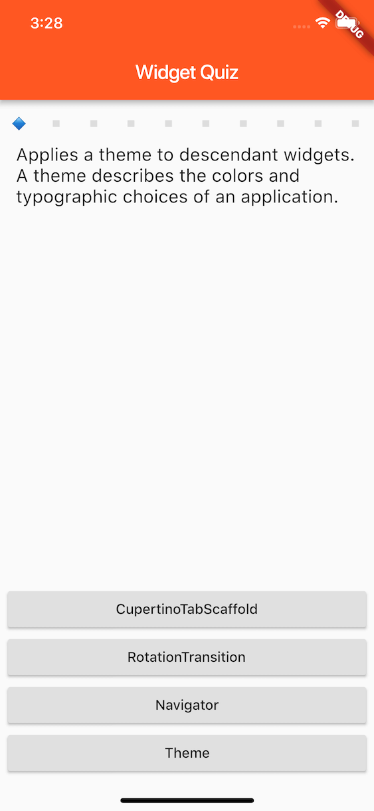
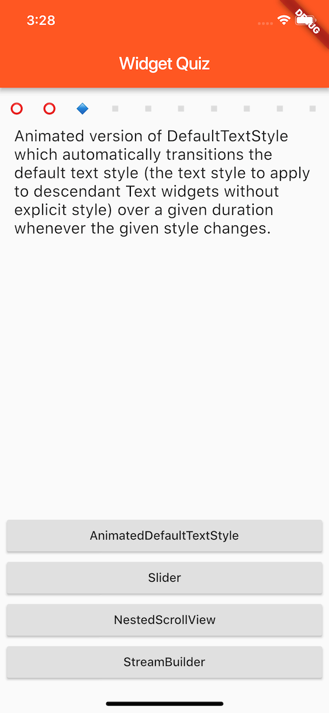
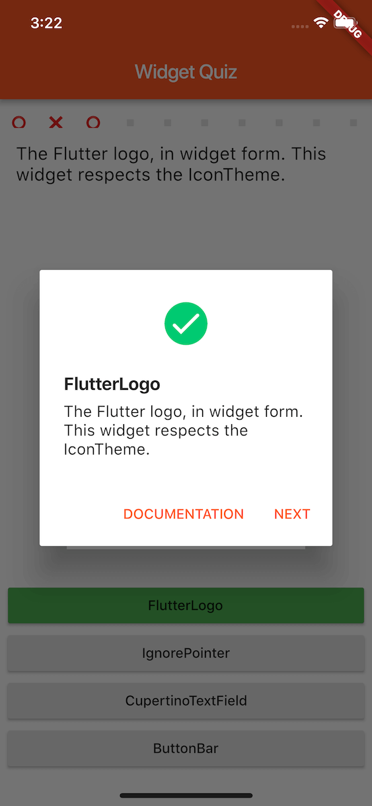
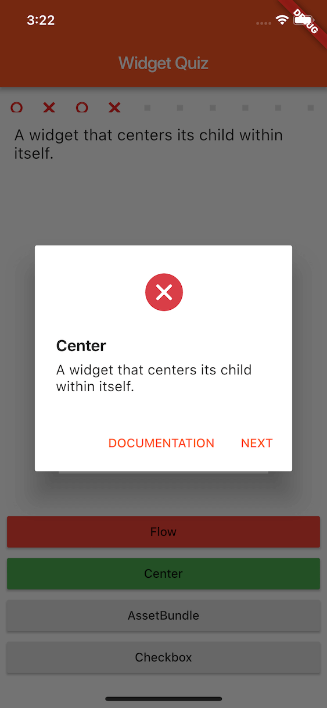
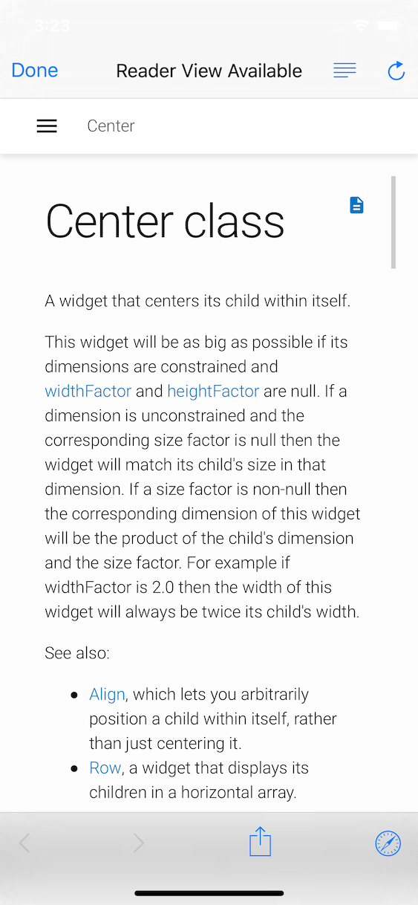
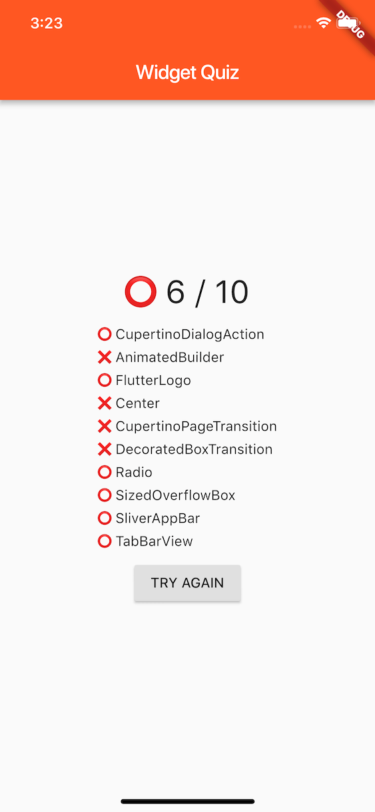

# Widget Quiz

With this app, users will learn Flutter widgets more efficiently.

1. Answer to Flutter widget quizez.
2. You can jump to document if you like after answered a quiz.
3. After answering 10 quizez, the summary is shown.

## Dart code size: 5,109 Bytes

This app was created for [Flutter Create - Flutter](https://flutter.dev/create), which limits Dart code size to 5KB.

Confirmed by `find ./lib -name "*.dart" | xargs cat | wc -c`.

## Screenshots

Answer to questions | .
--- | --
 | 

Correct answer | after
--- | --
 | 

Jump to documentation | Result summary
--- | --
 | 

## Install

Not released officially yet, but you can run from the project or install via these links.

- [iOS (TestFlight)](https://testflight.apple.com/join/lv0nu3lw)
- [Android (Beta)](https://play.google.com/apps/testing/com.mono0926.widgetquiz)

## Credits

- Quiz source: https://github.com/flutter/website/blob/master/src/_data/catalog/widgets.json
- Animations
    - https://www.2dimensions.com/a/pollux/files/flare/success-check
    - https://www.2dimensions.com/a/blaxkies/files/flare/status-es
